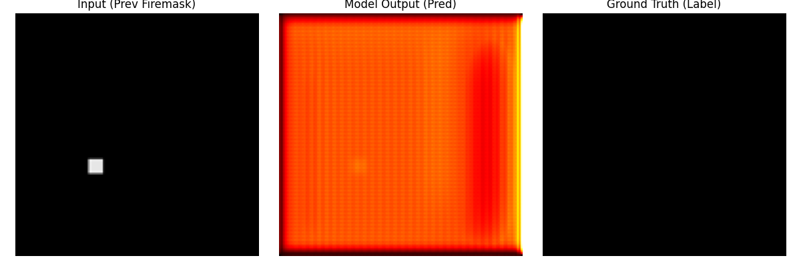

# 2025 제 2회 융합탐구 321체
## 충북과학고등학교 팀 코팅"좌"

## 주제 : 산불 확산 경로 예측 및 생물학적 코팅제를 통한 산불 확산 억제

본 리포지토리는 위 탐구의 일부로, 지역의 식생지수, 풍향, 풍속, 온도 등을 수집하여 전날의 화재 지점 이미지를 기반으로 당일의 산불 발생 지점을 예측하는 것을 Task로 하는 모델을 포함합니다. 최종 데이터 수집 코드는 포함하지 않습니다.

` data ` 폴더에 최종적으로 사용한 데이터가 위치합니다.

` data_utils.py ` 는 모델이 입력으로 받는 dataset을 정의하는 코드입니다.

` model.py ` 는 Unet 기반 네트워크 구조를 저장하는 코드입니다.

` train.ipynb ` 는 해당 모델, 데이터로 학습을 진행한 노트북입니다.

` data_visualize `는 학습된 모델로 모델의 출력, 입력과 실제 정답 이미지를 시각화하는 코드입니다.

학습된 각 모델은 ` 0715_1 ` 과 같이 ` 일자_실험번호 ` 내부에 저장되어 있습니다.

## 모델 구조

다음과 같은 U-net 기반 모델을 사용하였습니다.
정사각형의 이미지 지역에 해당하는 식생지수, 풍향, 풍속, 온도 등 총 15개 특징을 흑백 이미지 사이즈에 맞게 브로드캐스팅하여 128 * 128 * 16 shape 을 입력 샘플로 합니다.

출력은 128 * 128 * 1의 이미지로, 모델이 예측한 각 지점의 화재 발생 확률입니다.

가장 성능이 좋은 모델은 본 리포지토리상 `0715_5 ` 로, 하이퍼파라미터로
` encoder channels, decoder channels, kernel sizes, image size ` 을 각각
` [[32, 64, 128], [128, 64, 32], [3, 3, 3, 5, 3, 3, 3], 128] ` 으로 갖습니다.

## 모델 학습

하이퍼파라미터 조정해가며 RTX 2080 super 환경에서 24에포크씩 학습을 진행하였습니다.

## 결과 시각화

위 두 결과에서 모델이 전날 산불이 발생한 여러 지점 중에서, 한 곳에만 산불이 여전히 남아있는 것을 잘 예측하는 것을 관찰할 수 있습니다.

위 두 결과에서 모델이 전날 산불이 발생하였지만, 기타 데이터를 고려하여 다음날 산불이 발생하지 않는 것을 잘 예측하는 것을 볼 수 있습니다.

